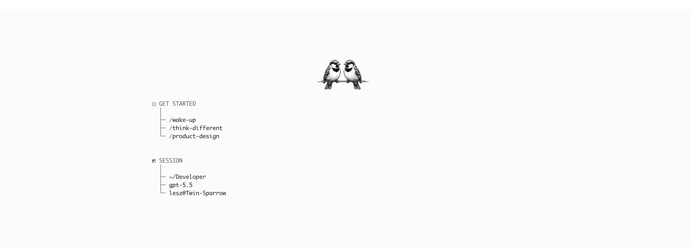
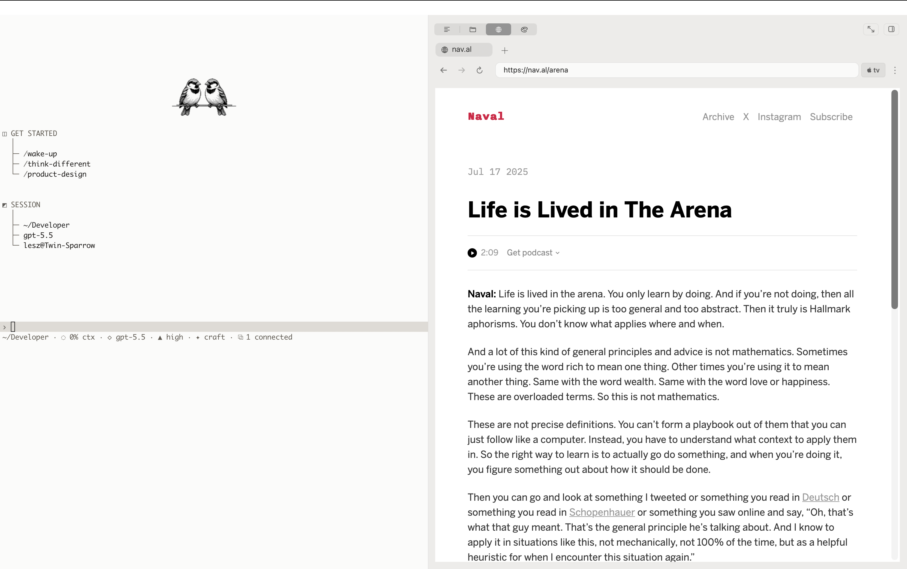

# Rhine

**Developer · Researcher · Photographer**
Philippines

> I build systems at the boundary of code, scientific inquiry, and epistemic rigor —
> tools that make reasoning **inspectable** instead of theatrical.

Across everything I ship, one constraint holds: **if the model disappeared, the core should still compute.**
Continuity over conversation. Proof over polish. Direction over abundance.

---

## What I Work On

- causal AI systems and auditable reasoning
- long-lived agents with persistent, inspectable memory
- research orchestration, verification, and falsification loops
- high-fidelity, terminal-native product interfaces

---

## Featured Projects

### [twin-sparrow](https://github.com/Lesz-Xi/twin-sparrow)

A coding **companion that remembers.** An Obsidian-native memory vault, dated-journal continuity, and composable skills — carried across terminal, web, and iOS. A session isn't a chat that ends; it's a process that leaves an on-disk trail the next session reads before it acts.

`TypeScript` · `monorepo` · `agent runtime`

### [twin-sparrow-claude-adapter](https://github.com/Lesz-Xi/twin-sparrow-claude-adapter)

A Claude Code plugin that injects **Twin-Sparrow companion capsules per turn**, gated by a verification contract that blocks closure until proof obligations pass. Reasoning has to earn its conclusion.

`TypeScript` · `Claude Code plugin` · `verification gate`

### [Aurelian](https://github.com/Lesz-Xi/Aurelian)

A premium, macOS-inspired, **terminal-native development environment** — real PTY sessions, workspace persistence, theming, and IDE-grade architecture. The terminal treated as a designed surface, not an afterthought.

`TypeScript` · `PTY` · `IDE architecture`

---

## Research Lineage

Pearl's do-calculus. Popper's falsifiability. Deutsch's criterion that good explanations are hard to vary. Maltz's cybernetic self-image.

These are not decorative influences. They are load-bearing constraints.

`Causal inference` · `Philosophy of science` · `Theoretical neuroscience` · `Higher-order cognition`

---

## Design and Photography

Photography is how I train perception.

The same discipline that produces a decisive frame produces a decisive interface:

- remove noise
- preserve structure
- make signal legible
- commit to the shot

---

## GitHub Activity

---

## Connect

---

*为学日益，为道日损*

*In pursuit of knowledge, every day something is added.*
*In pursuit of the Way, every day something is dropped.*

— *Tao Te Ching*, Ch. 48

